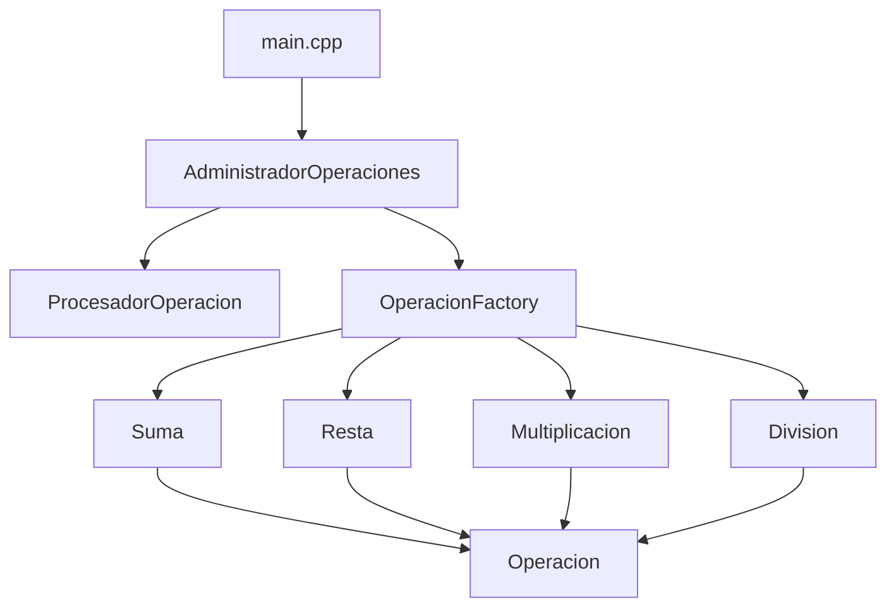

# Calculadora TDD - Proyecto C++

## 📋 Descripción General

Este proyecto es una **calculadora básica** implementada en C++ siguiendo los principios de **Desarrollo Dirigido por Pruebas (TDD)**. La aplicación permite realizar operaciones aritméticas fundamentales (suma, resta, multiplicación y división) a través de una interfaz de línea de comandos, procesando expresiones matemáticas en formato de cadena.

### Propósito
- Demostrar la implementación de patrones de diseño en C++ (Strategy, Factory)
- Practicar el desarrollo dirigido por pruebas usando Google Test
- Aplicar principios de programación orientada a objetos (herencia, polimorfismo)
- Gestionar la construcción del proyecto con CMake

## 🏗️ Estructura del Proyecto

```
Lab1/
├── 📁 src/                          # Código fuente principal
│   ├── 📄 main.cpp                  # Punto de entrada de la aplicación
│   ├── 📄 Operacion.h              # Interfaz base para operaciones
│   ├── 📄 Suma.h/.cpp              # Implementación de suma
│   ├── 📄 Resta.h/.cpp             # Implementación de resta
│   ├── 📄 Multiplicacion.h/.cpp    # Implementación de multiplicación
│   ├── 📄 Division.h/.cpp          # Implementación de división
│   ├── 📄 OperacionFactory.h/.cpp  # Factory para crear operaciones
│   ├── 📄 ProcesadorOperacion.h/.cpp # Parser de expresiones
│   └── 📄 AdministradorOperaciones.h/.cpp # Coordinador principal
├── 📁 test/                         # Pruebas unitarias
│   ├── 📄 test_suma.cpp            # Pruebas para la clase Suma
│   ├── 📄 test_procesador.cpp      # Pruebas para el procesador
│   └── 📄 test_administrador.cpp   # Pruebas para el administrador
├── 📁 googletest/                   # Framework de testing
├── 📁 build/                        # Archivos de compilación
├── 📄 CMakeLists.txt               # Configuración de CMake
└── 📄 README.md                    # Este archivo
```

## 🛠️ Tecnologías Utilizadas

- **C++17**: Lenguaje de programación principal
- **CMake 3.10+**: Sistema de construcción y gestión de dependencias
- **Google Test**: Framework de pruebas unitarias
- **Git**: Control de versiones

## 🏛️ Arquitectura

El proyecto implementa una **arquitectura orientada a objetos** con los siguientes patrones de diseño:

### Patrón Strategy
- **Interfaz**: `Operacion` (clase abstracta)
- **Implementaciones concretas**: `Suma`, `Resta`, `Multiplicacion`, `Division`
- **Beneficio**: Permite intercambiar algoritmos de operación en tiempo de ejecución

### Patrón Factory
- **Clase**: `OperacionFactory`
- **Propósito**: Crear instancias de operaciones basadas en el operador (+,-,*,/)
- **Beneficio**: Centraliza la lógica de creación de objetos

### Componentes Principales

1. **AdministradorOperaciones**: Coordinador principal que orquesta el cálculo
2. **ProcesadorOperacion**: Parsea expresiones matemáticas en tokens
3. **OperacionFactory**: Crea instancias de operaciones según el operador
4. **Operaciones**: Implementaciones específicas de cada operación aritmética



## 🚀 Instrucciones de Configuración

### Requisitos Previos
- **Compilador C++**: GCC 7+ o Clang 5+ con soporte para C++17
- **CMake**: Versión 3.10 o superior
- **Git**: Para clonar el repositorio

### Pasos de Instalación

1. **Clonar el repositorio** (si aplica):
   ```bash
   git clone <url-del-repositorio>
   cd Lab1
   ```

2. **Crear directorio de construcción**:
   ```bash
   mkdir build
   cd build
   ```

3. **Configurar el proyecto con CMake**:
   ```bash
   cmake ..
   ```

4. **Compilar el proyecto**:
   ```bash
   make
   ```

### Ejecución de la Aplicación

```bash
# Desde el directorio build/
./calculadora_app
```

## 🧪 Ejecución de Pruebas

El proyecto incluye un conjunto completo de pruebas unitarias utilizando Google Test.

### Ejecutar todas las pruebas:
```bash
# Desde el directorio build/
./test_runner
```

### Ejecutar pruebas específicas:
```bash
# Ejecutar solo pruebas de suma
./test_runner --gtest_filter="SumaTest.*"

# Ejecutar solo pruebas del procesador
./test_runner --gtest_filter="ProcesadorTest.*"
```

### Verificación de la cobertura de pruebas:
```bash
# Ejecutar todas las pruebas con información detallada
./test_runner --gtest_output=xml:test_results.xml
```

## 📊 Pruebas Incluidas

- **SumaTest**: Verifica la funcionalidad básica de suma
- **ProcesadorTest**: Valida el parsing de expresiones matemáticas
- **AdministradorTest**: Prueba la integración de componentes

## 🔧 Desarrollo

### Estructura de Clases
- Todas las operaciones implementan la interfaz `Operacion`
- El factory pattern permite agregar nuevas operaciones fácilmente
- El procesador maneja la tokenización de expresiones complejas

### Agregar Nueva Operación
1. Crear clase que herede de `Operacion`
2. Implementar el método `ejecutar()`
3. Registrar en `OperacionFactory`
4. Agregar pruebas unitarias correspondientes

## 📝 Notas Adicionales

- El proyecto utiliza **C++17** para aprovechar características modernas del lenguaje
- Se implementa **RAII** para gestión automática de memoria
- Las pruebas cubren casos básicos y casos límite
- La arquitectura es extensible para futuras funcionalidades

## 👥 Contribución

Para contribuir al proyecto:
1. Crear una rama para la nueva funcionalidad
2. Implementar siguiendo TDD (escribir pruebas primero)
3. Asegurar que todas las pruebas pasen
4. Enviar pull request con descripción detallada

---

*Proyecto desarrollado como parte de un laboratorio de programación orientada a objetos en C++*
